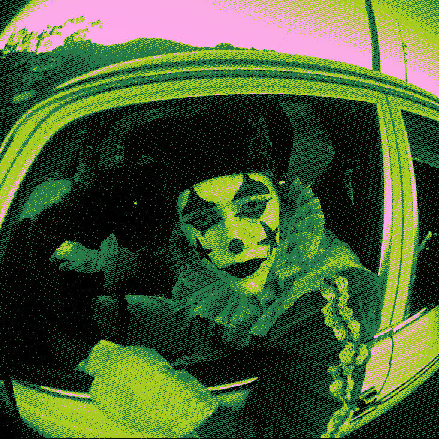

# VibeDither (v0.9)

**High-performance, GPU-accelerated image dithering and aesthetic reconstruction.**

## 🧪 The "Vibe Coding" Experiment

This project is a 100% "vibecoded" application. It was built entirely through prompting **Gemini 2.5 and Gemini 3 CLI**. 

**The catch:** I have absolutely zero knowledge of Rust or any other programming language. I only have a "spoonful" of knowledge regarding basic debugging and how to work around technical obstacles. This app is a tool for my personal use and a test to see exactly how far AI vibe coding can be pushed when the "developer" doesn't actually know how to code, only how to prompt and iterate.

## 🖼️ Gallery
| Aesthetic Curves | Gradient Based Dither | Stippling (v2) |
| :---: | :---: | :---: |
|  |  |  |

## ⚠️ Current Status: v0.9 (Work in Progress)

The application is currently at version **0.9**. 
- **The UI is currently broken/unpolished.** I needed to commit this version to Git because it represents a "mostly working" state of the core pipeline.
- **The Vision:** The final version will feature a much more tactical, high-contrast terminal UI. You can see the design intent in the `UI/` folder.

## 🧱 The Walls We Hit

During development, we ran into two major "walls" where neither I nor the AI could find a way through:

1.  **Video Support:** I wanted to add video processing, but since I don't understand **FFmpeg** and the AI struggled to bridge that gap without my technical guidance, we ended up running in circles. Video support has been removed to focus on static images.
2.  **Halftone Effects:** I wanted a proper halftone effect, but neither the AI nor I could conceptually grasp the math/logic required to implement it correctly in the shader, so it was abandoned after several failed attempts.

## 🛠️ Performance & Code Quality

If you are an actual programmer, feel free to dive into the code. I honestly don't know if it's high-performance or a total disaster under the hood—that's part of the experiment. If you find something interesting (good or bad) about the code structure produced by the AI, please share your findings! It helps us all understand where "Vibe Coding" stands in 2026.

## 🐞 Bugs & Issues

Feel free to submit bugs or issues. I will look into them in my free time, but **please don't expect me to actually fix them.** Since I don't understand what I'm doing in the codebase, I'm just as likely to break it further as I am to fix it!

---
*Created with Gemini CLI and a lot of vibes.*
