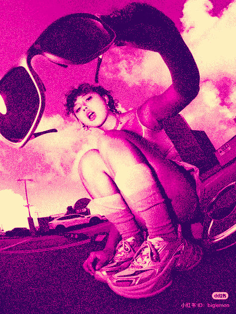

# VibeDither (v1.1)

**High-performance, GPU-accelerated image and video dithering with a futuristic terminal aesthetic.**

## 🧪 The "Vibe Coding" Experiment

This project is a 100% "vibecoded" application. It was built entirely through prompting **Gemini CLI**. 

**The catch:** I have absolutely zero knowledge of Rust or any other programming language. I only have a "spoonful" of knowledge regarding basic debugging and how to work around technical obstacles. This app is a tool for my personal use and a test to see exactly how far AI vibe coding can be pushed when the "developer" doesn't actually know how to code, only how to prompt and iterate.

## 🖼️ Gallery
| Aesthetic Curves | Gradient Based Dither | Stippling (v2) |
| :---: | :---: | :---: |
|  |  |  |

## 🚀 Status: v1.1 (The Video Update)

The application has reached version **1.1**, marking a major milestone in AI-driven development.

### Key Features:
- **Full Video Support:** Load, preview, and export videos (.mp4, .mkv, .mov, etc.) with high-performance dithering and audio preservation.
- **Stealth FFmpeg Integration:** All video processing happens in the background. No more command prompt windows popping up!
- **Real-time Progress:** Dedicated progress bar and percentage display for video exports.
- **Tactical UI:** A monochromatic "Matrix Green" terminal style (RGB 0, 255, 0) built with `egui` and `wgpu`.
- **Keyboard-Centric Workflow:** Navigate menus, adjust parameters, and apply presets entirely via keyboard (WASD + Enter).
- **Pro Performance:** Optimized 16-bit floating-point pipeline. Verified to run with **amazing performance even on legacy hardware like the NVIDIA GT 730**.

## 🧱 The Walls We Broke

Initially, video support was considered a "wall" we couldn't climb. However, through persistent iteration and deep-diving into process management with the AI, we successfully implemented a robust video pipeline using native `std::process::Command` calls to FFmpeg, bypassing the limitations of higher-level libraries.

## 🛠️ Tech Stack
- **Language:** Rust
- **Graphics:** `wgpu` (DirectX 12/Vulkan)
- **UI:** `egui` (Custom Tactical Styling)
- **Processing:** FFmpeg (Background CLI integration)

## 🛠️ Performance & Code Quality

If you are an actual programmer, feel free to dive into the code. I honestly don't know if it's high-performance or a total disaster under the hood—that's part of the experiment. However, the fact that it runs smoothly on a **GT 730** suggests the AI did a decent job with the `wgpu` implementation!

## 🐞 Bugs & Issues

Feel free to submit bugs or issues. Since I don't understand what I'm doing in the codebase, I'll be using the same AI "vibes" to try and fix them!

## 🕳️ Future Ideas
- Support audio playback inside the app
- More dithering methods?
- Stippling
- Halftone
- ASCII
- Keep video support for all methods

---
*Created with Gemini CLI and a lot of vibes.*
